# Diagrama de Flujo: Sistema Original Apollo Traffic Light Detection

## Flujo Completo del Sistema Apollo TLR

```mermaid
flowchart TB
    subgraph INPUT["📥 ENTRADAS DEL SISTEMA"]
        IMG[("🖼️ Imagen de Cámara<br/>(1920×1080)")]
        HDMAP[("🗺️ HD-Map<br/>(Coordenadas 3D de semáforos)")]
        POSE[("📍 Pose del Vehículo<br/>(GPS + TF Transform)")]
        CALIB[("📐 Calibración de Cámara<br/>(Matriz de proyección)")]
    end

    subgraph PREP["🔷 ETAPA 1: PREPROCESAMIENTO (Region Proposal)"]
        direction TB

        subgraph PREP_IN["Entradas"]
            P_IN1["• Pose del vehículo (6-DOF)"]
            P_IN2["• HD-Map signals (coordenadas 3D)"]
            P_IN3["• Calibración de múltiples cámaras"]
        end

        subgraph PREP_PROC["Procesamiento"]
            direction TB
            P1["🔍 Query HD-Map<br/>GetSignals(pose, 150m)"]
            P2["🎯 Proyección 3D → 2D<br/>Para cada semáforo:<br/>world_coords → camera_coords"]
            P3["📷 Selección de Cámara<br/>Telephoto (25mm) vs Wide (6mm)<br/>Basado en focal length"]
            P4["✅ Validación de Proyección<br/>¿Dentro de imagen?<br/>¿Dentro de borders?"]

            P1 --> P2
            P2 --> P3
            P3 --> P4
        end

        subgraph PREP_OUT["Salidas"]
            P_OUT1["• Lista de TrafficLight objects"]
            P_OUT2["• projection_roi para cada semáforo"]
            P_OUT3["• Cámara seleccionada"]
            P_OUT4["• 1 HD-Map light → 1 projection box"]
        end

        PREP_IN --> PREP_PROC
        PREP_PROC --> PREP_OUT
    end

    subgraph DETECT["🔷 ETAPA 2: DETECCIÓN"]
        direction TB

        subgraph DET_IN["Entradas"]
            D_IN1["• TrafficLight objects con projection_roi"]
            D_IN2["• Imagen de cámara seleccionada"]
            D_IN3["• detected_bboxes_ = []"]
        end

        subgraph DET_PROC["Procesamiento"]
            direction TB

            D1["🔄 Loop Serial sobre Projections<br/>for each projection_roi:"]
            D2["✂️ ROI Expansion (CropBox)<br/>crop_scale = 2.5×<br/>Compensa imprecisión de proyección"]
            D3["📦 Crop Imagen<br/>Extraer región crop_roi"]
            D4["📏 Resize a 270×270<br/>Input fijo para CNN"]
            D5["🧠 CNN Inference (SSD-style)<br/>Modelo: tl.torch<br/>Output: [img_id, x1, y1, x2, y2, bg_score, v_score, q_score, h_score]"]
            D6["📊 SelectOutputBoxes<br/>Para cada detection en output:<br/>• Filtrar por class (skip bg)<br/>• Transform coords a imagen original<br/>• Validar bounds<br/>• ✨ push_back(detection)"]

            D1 --> D2
            D2 --> D3
            D3 --> D4
            D4 --> D5
            D5 --> D6
            D6 -.->|"Siguiente projection"| D1
        end

        subgraph DET_NMS["NMS Global"]
            N1["🎯 ApplyNMS(detected_bboxes_)<br/>IoU threshold = 0.6<br/>Sort: ASCENDING por score<br/>Greedy NMS"]
        end

        subgraph DET_OUT["Salidas"]
            D_OUT1["• detected_bboxes_: N detections"]
            D_OUT2["• Múltiples detections por ROI posibles"]
            D_OUT3["• Cada detection tiene:<br/>  - detection_roi<br/>  - detect_class_id<br/>  - detect_score"]
        end

        DET_IN --> DET_PROC
        DET_PROC --> DET_NMS
        DET_NMS --> DET_OUT
    end

    subgraph SELECT["🔷 ETAPA 3: ASIGNACIÓN (Hungarian Algorithm)"]
        direction TB

        subgraph SEL_IN["Entradas"]
            S_IN1["• detected_bboxes_: N detections<br/>(después de NMS)"]
            S_IN2["• hdmap_bboxes: M HD-Map lights<br/>(con projection_roi)"]
        end

        subgraph SEL_PROC["Procesamiento"]
            direction TB

            S1["📐 Construcción de Matriz de Costos M×N"]
            S2["💯 Para cada par (hdmap[i], detection[j]):<br/><br/>distance_score = Gaussian2D(center_hd, center_det, σ=100)<br/>   exp(-0.5 × ((Δx/σ)² + (Δy/σ)²))<br/><br/>detection_score = min(detect_score, 0.9)<br/><br/>combined_score = 0.7 × distance + 0.3 × confidence"]
            S3["🚫 Validación ROI (ANTES de Hungarian)<br/>Si detection fuera de crop_roi:<br/>   cost[i,j] = 0"]
            S4["🎲 Hungarian Algorithm<br/>munkres.Maximize(cost_matrix)<br/>Encuentra asignación óptima 1-to-1"]
            S5["✅ Post-procesamiento<br/>Para cada assignment:<br/>• Verificar is_selected flags<br/>• Marcar como selected<br/>• Copiar detection_roi a hdmap_bbox<br/>• Copiar class_id y score"]

            S1 --> S2
            S2 --> S3
            S3 --> S4
            S4 --> S5
        end

        subgraph SEL_OUT["Salidas"]
            S_OUT1["• hdmap_bboxes actualizado"]
            S_OUT2["• 1 HD-Map light → MAX 1 detection"]
            S_OUT3["• Flags is_selected previenen reasignación"]
            S_OUT4["• Algunas detections quedan sin asignar"]
        end

        SEL_IN --> SEL_PROC
        SEL_PROC --> SEL_OUT
    end

    subgraph RECOG["🔷 ETAPA 4: RECONOCIMIENTO"]
        direction TB

        subgraph REC_IN["Entradas"]
            R_IN1["• TrafficLight objects con detection_roi"]
            R_IN2["• detect_class_id (vertical/quad/horizontal)"]
        end

        subgraph REC_PROC["Procesamiento"]
            direction TB

            R1["🔀 Switch por detect_class_id"]
            R2["🟢 Vertical Model<br/>classify_vertical_.Perform()<br/>Modelo: vert.torch"]
            R3["🟡 Quadrate Model<br/>classify_quadrate_.Perform()<br/>Modelo: quad.torch"]
            R4["🔴 Horizontal Model<br/>classify_horizontal_.Perform()<br/>Modelo: hori.torch"]
            R5["❓ Si NO detectado:<br/>color = TL_UNKNOWN_COLOR"]

            R1 --> R2
            R1 --> R3
            R1 --> R4
            R1 --> R5
        end

        subgraph REC_OUT["Salidas"]
            R_OUT1["• light->status.color<br/>(RED, GREEN, YELLOW, BLACK, UNKNOWN)"]
            R_OUT2["• light->status.confidence"]
        end

        REC_IN --> REC_PROC
        REC_PROC --> REC_OUT
    end

    subgraph TRACK["🔷 ETAPA 5: TRACKING (Semantic Decision)"]
        direction TB

        subgraph TRK_IN["Entradas"]
            T_IN1["• TrafficLights con color actual"]
            T_IN2["• Semantic ID (del HD-Map)"]
            T_IN3["• History buffer (estados previos)"]
        end

        subgraph TRK_PROC["Procesamiento"]
            direction TB

            T1["🏷️ Agrupar por Semantic ID<br/>Semáforos con mismo semantic_id<br/>pertenecen al mismo grupo físico"]
            T2["🗳️ Voting por Grupo<br/>Para cada semantic group:<br/>  vote[color] = count<br/>  max_color = argmax(vote)"]
            T3["⏱️ Revisión Temporal<br/>if (timestamp - last_ts < 1.5s):<br/>  Aplicar reglas de transición"]
            T4["📋 Reglas de Transición:<br/>• YELLOW→RED: mantener RED<br/>• BLACK: hysteresis (3 frames)<br/>• Prevenir cambios rápidos"]
            T5["💡 Detección de Blink<br/>if (dark_interval > 0.4s &&<br/>    bright_interval > 0.4s):<br/>  blink = true (solo GREEN)"]

            T1 --> T2
            T2 --> T3
            T3 --> T4
            T4 --> T5
        end

        subgraph TRK_OUT["Salidas"]
            T_OUT1["• light->status.color (revisado)"]
            T_OUT2["• light->status.blink"]
            T_OUT3["• History actualizado"]
        end

        TRK_IN --> TRK_PROC
        TRK_PROC --> TRK_OUT
    end

    subgraph OUTPUT["📤 SALIDA FINAL"]
        RESULT[("🚦 TrafficLightDetectionResult<br/><br/>Para cada semáforo:<br/>• ID (del HD-Map)<br/>• Bounding box (detection_roi)<br/>• Color (RED/GREEN/YELLOW/BLACK/UNKNOWN)<br/>• Confidence<br/>• Blink status<br/>• Semantic ID")]
    end

    %% Flujo principal
    IMG --> PREP
    HDMAP --> PREP
    POSE --> PREP
    CALIB --> PREP

    PREP --> DETECT
    DETECT --> SELECT
    SELECT --> RECOG
    RECOG --> TRACK
    TRACK --> OUTPUT

    %% Estilos
    classDef inputStyle fill:#e1f5fe,stroke:#01579b,stroke-width:2px
    classDef prepStyle fill:#f3e5f5,stroke:#4a148c,stroke-width:2px
    classDef detectStyle fill:#fff3e0,stroke:#e65100,stroke-width:2px
    classDef selectStyle fill:#e8f5e9,stroke:#1b5e20,stroke-width:2px
    classDef recogStyle fill:#fce4ec,stroke:#880e4f,stroke-width:2px
    classDef trackStyle fill:#e0f2f1,stroke:#004d40,stroke-width:2px
    classDef outputStyle fill:#fff9c4,stroke:#f57f17,stroke-width:2px

    class INPUT,IMG,HDMAP,POSE,CALIB inputStyle
    class PREP,PREP_IN,PREP_PROC,PREP_OUT,P1,P2,P3,P4,P_IN1,P_IN2,P_IN3,P_OUT1,P_OUT2,P_OUT3,P_OUT4 prepStyle
    class DETECT,DET_IN,DET_PROC,DET_NMS,DET_OUT,D1,D2,D3,D4,D5,D6,N1,D_IN1,D_IN2,D_IN3,D_OUT1,D_OUT2,D_OUT3 detectStyle
    class SELECT,SEL_IN,SEL_PROC,SEL_OUT,S1,S2,S3,S4,S5,S_IN1,S_IN2,S_OUT1,S_OUT2,S_OUT3,S_OUT4 selectStyle
    class RECOG,REC_IN,REC_PROC,REC_OUT,R1,R2,R3,R4,R5,R_IN1,R_IN2,R_OUT1,R_OUT2 recogStyle
    class TRACK,TRK_IN,TRK_PROC,TRK_OUT,T1,T2,T3,T4,T5,T_IN1,T_IN2,T_IN3,T_OUT1,T_OUT2,T_OUT3 trackStyle
    class OUTPUT,RESULT outputStyle
```

## 🔑 Puntos Clave del Flujo Original

### 1. **Preprocesamiento: HD-Map Driven**
- **Query dinámico**: Por cada frame, consulta HD-Map para obtener semáforos en un radio de 150m
- **Proyección 3D→2D**: Usa pose del vehículo (GPS + TF) y calibración de cámara
- **Multi-cámara**: Selecciona entre telephoto (25mm) y wide-angle (6mm) según focal length
- **Resultado**: 1 semáforo HD-Map → 1 projection box 2D

### 2. **Detección: Multi-Detection por ROI**
- **Loop serial**: Procesa cada projection_roi uno por uno
- **ROI Expansion**: 2.5× para compensar imprecisión de proyección
- **CNN Output**: Puede generar múltiples detections por cada ROI
- **Push-back**: Todas las detections válidas se agregan a `detected_bboxes_` (línea 363 en detection.cc)
- **NMS Global**: Filtra duplicados con IoU threshold 0.6

### 3. **Asignación: Hungarian 1-to-1**
- **Matriz M×N**: M HD-Map lights × N detections (post-NMS)
- **Scoring combinado**: 70% distancia gaussiana + 30% confidence
- **Validación ROI**: Antes del Hungarian, descarta detections fuera de crop_roi (cost=0)
- **Hungarian Algorithm**: Encuentra asignación óptima
- **Post-procesamiento**: Flags `is_selected` aseguran 1-to-1 (líneas 99-100 en select.cc)
- **Resultado**: 1 HD-Map light → MAX 1 detection asignada

### 4. **Reconocimiento: Orientation-Specific**
- **Modelos separados**: vert.torch, hori.torch, quad.torch
- **Switch por clase**: Usa `detect_class_id` de la detección
- **Output**: Color (RED/GREEN/YELLOW/BLACK/UNKNOWN) + confidence

### 5. **Tracking: Semantic Decision**
- **Semantic IDs**: Del HD-Map, identifican grupos de semáforos relacionados
- **Voting por grupo**: Semáforos con mismo semantic_id votan por color
- **Revisión temporal**: Previene cambios bruscos usando historia (1.5s window)
- **Blink detection**: Detecta intermitencia en verdes (0.4s threshold)
- **Hysteresis**: 3 frames para transición BLACK→otro color

## 📊 Cardinalidades Clave

| Etapa | Entrada | Salida | Relación |
|-------|---------|--------|----------|
| **Preprocesamiento** | M semáforos HD-Map | M projection boxes | 1:1 |
| **Detección (Inference)** | M projection boxes | N detections (N ≥ M) | 1:N |
| **Detección (NMS)** | N detections | N' detections (N' ≤ N) | N:N' |
| **Asignación (Hungarian)** | M projections + N' detections | M lights (algunos con detection) | M+N':M (1-to-1) |
| **Reconocimiento** | M lights | M lights con color | 1:1 |
| **Tracking** | M lights | M lights revisados | 1:1 |

## ⚠️ Confusión "Multi-ROI"

**NO existe** en Apollo el concepto de "1 projection → múltiples detections asignadas".

- ✅ **Sí existe**: Múltiples detections generadas por el detector (línea 363: `push_back()`)
- ✅ **Sí existe**: NMS global que filtra duplicados
- ❌ **NO existe**: Asignar múltiples detections a un mismo HD-Map light
- ✅ **Sí existe**: Hungarian con flags `is_selected` que aseguran 1-to-1

**El `push_back()` está en la ETAPA DE DETECCIÓN, NO en el ASSIGNMENT.**

## 📁 Archivos Fuente Verificados

- `traffic_light_region_proposal_component.cc` (555 líneas) - Preprocesamiento
- `tl_preprocessor.cc` (358 líneas) - Proyección
- `detection.cc` (429 líneas) - Detección + NMS
- `select.cc` (134 líneas) - Hungarian assignment
- `recognition.cc` (83 líneas) - Reconocimiento
- `semantic_decision.cc` (296 líneas) - Tracking

**Total verificado**: ~1,855 líneas de código C++
